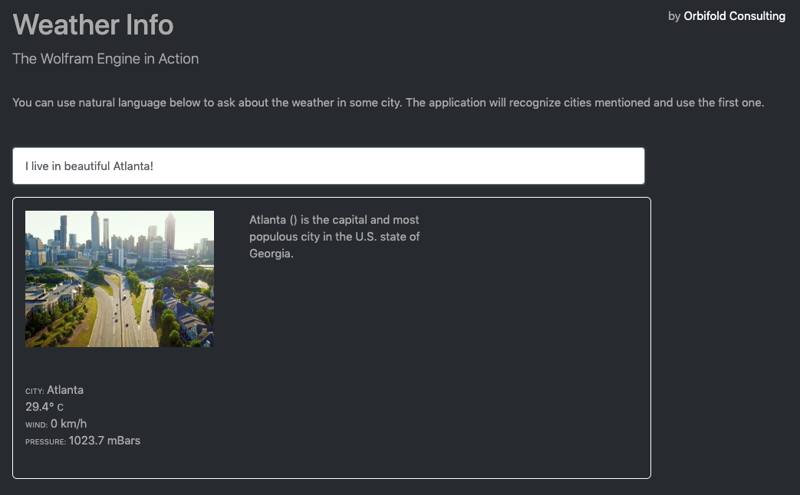

# Wolfy
A Flask web-app using the Wolfram Engine (Engine for short henceforth).

It's the minimal example of a Python based web app using the Wolfram Engine via the [Wolfram client library for Python](https://reference.wolfram.com/language/WolframClientForPython/). It highlights a few features which would be more complex to develop with more classic engines:

- named entity recognition (NER) is a oneliner here but would require a whole lot of packages (say [NLTK](http://www.nltk.org) or [SpaCy](http://spacy.io)) without the Engine.
- fetching images from Bing or Google would also require various packages and administration (i.e. subscription) and with the Engine it's just another onliner
- idem ditto for the weather (forecast)

The Engine is just a single box for a whole lot of technology you can assemble yourself in different ways but Wolfram makes it simply easy to prototype things.
That said, there are of course drawbacks and concerns as well but this would requires a book on its own (scalability, cost, security, continuous integration and whatnot). Aside from the grand enterprise architectural concerns the following came up during development of this POC:

- lots of magic happens but I think the Python client needs more maturity to be fully functional
- there is some latency and things sometimes 'disappear'; whether it's serialization or threading or inside the Engine is not always clear
- wrapping larger bits of Mathematica code in a string is not always straightforward. It seems the triple Python quote does not always work and how one should wrap complex logic is not clear (packages?).

All in all, the Engine is potentially a magical solution for all sorts of applications. The amount of (computational) intelligence you get for free is astonishing. At the same time, we are still far away from production-ready and scalable technology. I would describe this as prototyping paradise. You can take this beyond the POC-level to another technology or perhaps into the Wolfram Cloud.

 

If you need more info; info@orbifold.net or via [Twitter](https://twitter.com/theorbifold) and [Orbifol's site](https://orbifold.net).

# Setup

Follow the setup of the [Wolfram Engine](https://www.wolfram.com/engine/) which includes registering a Wolfram account if necessary. Once installed run

        wolframscript

to register the engine. You can have up to two (free) engines per account on any platform.

To setup the Python packages use the usual

        pip install -r requirements.txt
        
This includes the setup of the [Wolfram client library for Python](https://reference.wolfram.com/language/WolframClientForPython/).

Finally use

    python app.py
    
to run the backend and display the default `index.html`.                      
